<div align="center">
  
</div>

<br/>

<div align="center">

[](https://github.com/Nitinx12)

</div>

<div align="center">

[](https://www.linkedin.com/in/nitin-k-220651351/)
[](mailto:Nitin321x@gmail.com)
[](https://nitinx12.github.io)
[](https://www.linkedin.com/in/nitin-k-220651351/)

</div>

---

## `$ whoami`

**Data Analyst** with 2+ years of experience building dashboards and data pipelines that business teams actually use. I work across the full analytics cycle — raw extraction, SQL transformation, Power BI reporting, and stakeholder delivery.

Currently pursuing my **MBA in Finance** at the University of Delhi, bridging the gap between data and business strategy.

```
┌────────────────────────────────────────────────────────────────────────┐
│ 📍 Location    Delhi, India · Remote-ready · Hybrid-open               │
│ 💼 Seeking     Data Analyst roles                                      │
│ 🎓 Education   MBA Finance · BCom (Accountancy) · University of Delhi  │
│ 📊 Impact      40% reduction in manual reporting · 5+ data sources     │
│ ⚽ Football    CRPF Camp Team · Subroto Cup Runners-Up                 │
└────────────────────────────────────────────────────────────────────────┘
```

---

## `$ ls ./tech-stack/`

**Languages & Analytics**


**Data Visualization & BI**


**Databases**


**Data Engineering & Tools**


---

## `$ ls ./projects/`

| # | Project | What It Does | Stack | Status |
|---|---------|-------------|-------|--------|
| 01 | [**E-Commerce Sales Analytics**](https://github.com/Nitinx12/End-to-End-E-Commerce-Sales-Analytics) | End-to-end pipeline: raw CSVs → PostgreSQL → Python clean → DuckDB OLAP → Seaborn visuals | PostgreSQL · Python · DuckDB · SQLAlchemy | ✅ Shipped |
| 02 | [**Retail Data Warehouse**](https://github.com/Nitinx12/Retail_data_warehouse) | Star schema dimensional model with fact/dim separation, SCD handling, BI-ready output | PostgreSQL · SQL · Power BI | ✅ Shipped |
| 03 | [**Databricks Medallion Warehouse**](https://github.com/Nitinx12/Databricks_Medallion_Warehouse) | Production Airflow + dbt pipeline across Bronze → Silver → Gold layers | Databricks · Airflow · dbt | ✅ Shipped |
| 04 | [**Bike Store Relational Database**](https://github.com/Nitinx12/Bike-Store-Relational-Database) | Unstructured data → 9-table normalized schema with stored procs, triggers & views | PostgreSQL · SQL | ✅ Shipped |

---

## `$ cat ./certifications.txt`


---

## `$ github --stats`

<div align="center">


&nbsp;&nbsp;


</div>

<div align="center">


</div>

<div align="center">


</div>

---

## `$ snake --run`

<div align="center">

<picture>
  <source media="(prefers-color-scheme: dark)"  srcset="https://github.com/Nitinx12/Nitinx12/blob/output/github-contribution-grid-snake-dark.svg"/>
  <source media="(prefers-color-scheme: light)" srcset="https://github.com/Nitinx12/Nitinx12/blob/output/github-contribution-grid-snake.svg"/>
  
</picture>

</div>

---

<div align="center">

```
╔══════════════════════════════════════════════════════════════════╗
║   $ echo "Open to Data Analyst roles. Let's talk data."          ║
║   > Open to Data Analyst roles. Let's talk data.                 ║
║   $ _                                                            ║
╚══════════════════════════════════════════════════════════════════╝
```

[](https://www.linkedin.com/in/nitin-k-220651351/)
[](mailto:Nitin321x@gmail.com)
[](https://nitinx12.github.io)


</div>
